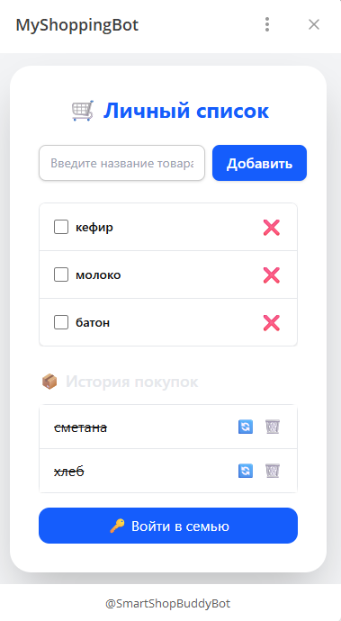
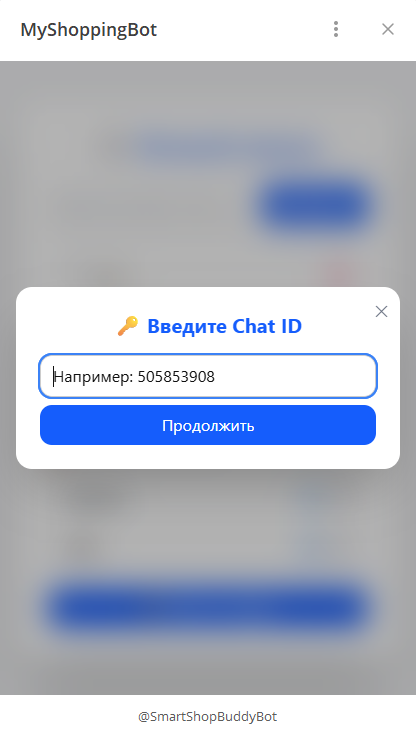
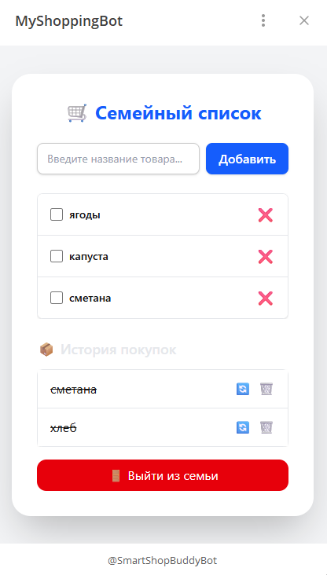

# smartshopbuddy

🛒 SmartShopBuddy — семейная корзина покупок (Web + Telegram Bot)

SmartShopBuddy — приложение для совместного ведения списка покупок.
Оно объединяет Telegram-бота, веб-приложение и сервер с MongoDB, позволяя нескольким пользователям пользоваться общей "семейной корзиной".

Вы можете добавлять товары, отмечать купленные, вести архив и переключаться между семьями. Всё синхронизируется между Telegram и веб-интерфейсом.

🚀 Функциональность

👪 Семьи
Создание собственной семьи (группы)
Переключение между семьями
Общая корзина для всех участников

🤖 Telegram-бот
Добавление товаров одним сообщением
Просмотр корзины
Пометка товаров как купленных
Архивация и удаление
Быстрый выбор семьи

🌐 Web-интерфейс (React + Zustand)
Полное управление корзиной
Архив покупок
Просмотр семей, переключение
Два режима:
Local Mode — локальное хранение
Server Mode — работа с MongoDB

🗄 Backend (Node.js + Express + MongoDB)
REST API для работы с корзиной и семьями
Гибкая структура данных
Автоматическое создание корзины при первом запросе

